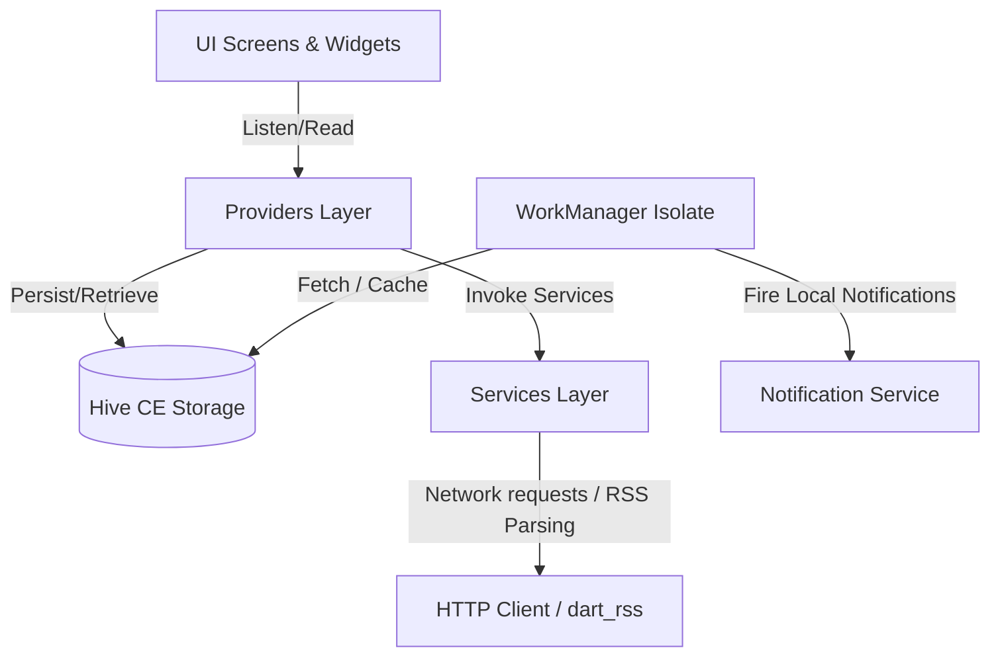

# 🍦 Dondurma RSS Reader — Geliştirici Dokümantasyonu (DEVELOPER.md)

Bu doküman, **Dondurma RSS Reader** uygulamasının mimarisini, veri katmanını, servis mekanizmalarını, optimizasyon yöntemlerini ve detaylı kod akışlarını açıklamak amacıyla mühendislik seviyesinde hazırlanmıştır. Yeni katılan geliştiricilerin projeyi derinlemesine anlamasını hedefler.

---

## 🗺️ 1. Genel Mimari ve Tasarım Desenleri

Dondurma RSS Reader, **MVVM (Model-View-ViewModel)** desenine yakın, state management (durum yönetimi) olarak **Provider (ChangeNotifier)** kütüphanesini temel alan reaktif bir mimariye sahiptir.

### 💉 Bağımlılık Ağacı ve ProxyProvider Yapısı
Uygulamanın durum yönetimi, birbirine bağımlı servislerin veri tutarlılığını sağlamak için `ChangeNotifierProxyProvider3` kullanılarak `lib/main.dart` üzerinde kurulmuştur:

1. **`SettingsProvider`**: Kullanıcı tercihlerini (karanlık mod, tema şeması, dil, filtre anahtar kelimeleri) yönetir. Diğer hiçbir provider'a bağımlılığı yoktur.
2. **`SubscriptionProvider`**: Abonelik kaynaklarını ve klasör (kategori) yapılarını tutar.
3. **`BookmarkProvider`**: Yer imlerine eklenen haberlerin durumunu ve tam JSON nesnelerini yönetir.
4. **`FeedProvider`**: Üç upstream provider'a (`SubscriptionProvider`, `SettingsProvider`, `BookmarkProvider`) bağımlıdır. Bunlardan birisi değiştiğinde reaktif olarak tetiklenerek arama, kategori filtreleme, keyword engelleme ve okundu/okunmadı durumlarını birleşik pipeline (veri hattı) üzerinden süzüp arayüze sunar. Her `update()` çağrısında filtreye gerçekten giren girdiler (global keyword'ler, feed bazlı keyword'ler ve yer imi ID kümesi) bir snapshot ile karşılaştırılır (`filterInputsChanged`); ilgisiz değişiklikler (tema, arama geçmişi, sessiz saat vb.) filtre cache'ini geçersiz kılmaz ve feed listesini yeniden çizdirmez.

---

## 📦 2. Veri Depolama ve Hive Kalıcılık Katmanı (Persistence)

Uygulamada yerel kalıcılık, yüksek performanslı ve bellek eşlemeli (memory-mapped) anahtar-değer (Key-Value) veritabanı olan **Hive CE (`hive_ce`)** ile sağlanmaktadır.

### 🗄️ Hive Kutuları (Boxes) ve Veri Modelleri

Uygulamada **3 adet aktif kutu** açılmaktadır:

#### 1. `'settings'` Kutusu
Küresel uygulama ayarlarını ve kullanıcı tercihlerini tutar.
*   `flexScheme` (String): Aktif FlexColorScheme tema şeması (Örn: `'material'`).
*   `themeMode` (String): Aktif parlaklık modu (Örn: `'system'`, `'light'`, `'dark'`).
*   `offlineCacheLimit` (int): Çevrimdışı okunacak maksimum makale sayısı (Varsayılan: `50`).
*   `cacheIntervalSeconds` (int): Ön plandaki otomatik senkronizasyon sıklığı (Varsayılan: `1800` saniye).
*   `syncBackground` (bool): Arka plan Workmanager senkronizasyonunun açık olup olmadığı.
*   `locale` (String): Dil kodu (Örn: `'en'`, `'tr'`).
*   `notificationsEnabled` (bool): Bildirim ana şalteri.
*   `digestMode` (String): Bildirim gönderim sıklığı (`'instant'`, `'daily'`, `'weekly'`).
*   `quietHoursEnabled` (bool): Sessiz saat modunun aktiflik durumu.
*   `quietHoursStart` (int) ve `quietHoursEnd` (int): Bildirimlerin sessize alınacağı saat dilimi aralığı (0-23 arası, Örn: 22 - 7).
*   `fontSize` (String): Makale yazı boyutu (`'small'`, `'medium'`, `'large'`, `'xl'`).
*   `typeface` (String): Makale font ailesi (`'system'`, `'serif'`, `'sans-serif'`, `'mono'`).
*   `lineSpacing` (double): Satır yüksekliği çarpanı (`1.2`, `1.5`, `1.8`).
*   `globalExcludedKeywords` (List<String>): Tüm akışlarda engellenecek anahtar kelimeler.
*   `searchHistory` (List<String>): Kullanıcının son aradığı 10 terim (MRU sırasıyla).
*   `adBlockEnabled` (bool): WebView içi reklam engelleyici durumu.
*   `webviewDarkModeEnabled` (bool): WebView içi DarkReader aktiflik durumu.
*   `browserMode` (String): Makale açılış yöntemi (`'builtin'`, `'external'`, `'system'`).
*   `hasSeenOnboarding` (bool): Onboarding ekranının gösterilip gösterilmediği.
*   `_boxesMigrated` (bool): Eski tek kutulu Hive şemasından yeni çok kutulu yapıya göç durumunun bayrağı.

#### 2. `'feeds'` Kutusu
Kategori, abonelik ve önbelleğe alınan akış verilerini yönetir.
*   `subscriptions` (String - JSON): `List<FeedSubscription>` JSON formatında encode edilerek tek bir string olarak saklanır.
*   `custom_categories` (String - JSON): Feeds eklenmemiş ancak kullanıcı tarafından elle oluşturulmuş boş kategori listesi.
*   `category_icons` (String - JSON): Kategori isimleri ile bunlara atanan `IconData.codePoint` eşleşmeleri (`Map<String, String>`).
*   `category_order` (String - JSON): Kategorilerin yan menüdeki özel sıralamasını tutan string listesi.
*   `cachedItemsJson` (String - JSON): Çevrimdışı okunmak üzere önbelleğe alınmış son makalelerin JSON listesi.
*   `readItemIds` (List<String>): Kullanıcının okuduğu makale ID'lerinin kümesi (`Set<String>`).
*   `bgKnownItemIds` (List<String>): Hem ön planda hem de arka planda senkronize edilen tüm makalelerin ID'leri. Mükerrer bildirim gönderimini engellemek için baseline olarak kullanılır.
*   `feedValidators` (String - JSON): Her feed URL'ine ait HTTP cache doğrulayıcı bilgileri (`etag` ve `lastModified`).

#### 3. `'bookmarks'` Kutusu
Kullanıcının kaydettiği yer imlerini yönetir.
*   `bookmarkedItemsJson` (String - JSON): `FeedItem` nesnelerinin tam JSON listesi. Bu sayede yer imine eklenen makaleler, kaynak akışın önbellek limiti dolup silinse dahi kaybolmaz.
*   `bookmarkedItemIds` (List<String>): Hızlı kontrol (O(1)) için yer imi eklenen ID listesi.

### 🔄 Veri Göçü (Migration) Algoritması
Eski sürümlerde tüm veriler tek bir `'settings'` kutusunda tutulmaktaydı. `lib/main.dart` içindeki `_migrateHiveBoxes()` fonksiyonu ilk çalıştırmada devreye girerek:
1. `_boxesMigrated` anahtarını kontrol eder.
2. Eğer `false` ise, `'subscriptions'`, `'custom_categories'`, `'cachedItemsJson'`, `'readItemIds'` verilerini `'feeds'` kutusuna taşır.
3. `'bookmarkedItemsJson'` ve `'bookmarkedItemIds'` verilerini `'bookmarks'` kutusuna taşır.
4. Orijinal `'settings'` kutusundaki eski anahtarları temizler ve `_boxesMigrated` değerini `true` yapar.

---

## ⚡ 3. Provider Yapıları ve İşleyiş Detayları

### 1. `SettingsProvider`
*   **Lazy Initialization**: Ayarları Hive'dan yükleme işlemi constructor'da eşzamanlı (synchronous) olarak yapılır. Hive bellek eşlemeli çalıştığı için kullanıcı arayüzü çizilmeden önce tüm ayarlar hazır durumdadır; reaktif bir gecikme yaşanmaz.
*   **Arama Geçmişi Limitleri**: `addSearchQuery(query)` metodunda girilen değer temizlenir (`trim`), mükerrer kayıtlar elenir, listenin başına eklenir ve listenin boyutu 10 eleman ile sınırlandırılır.

### 2. `SubscriptionProvider`
*   **Kategori Yönetimi**: Kategoriler dinamik bir birleşim kümesidir. `categories` getter metodu, aktif aboneliklerdeki (`_subscriptions.category`) kategoriler ile `_customCategories` (boş klasörler) kümesinin birleşimini (`union`) döndürür.
*   **İkon Çözümleme (`_resolveCategoryIcon`)**: Veritabanında saklanan ikon kodunun (codePoint) geçerliliği `categoryIconOptions` listesiyle kontrol edilir. Eğer veri eski emoji ikonlardan kalmaysa (`_legacyEmojiIcons` eşleşmesi ile), karşılık gelen Material 3 ikonuna çevrilir. Eğer geçersiz bir veri varsa varsayılan ikon olan `Icons.folder_outlined` döndürülür.
*   **Kategori Silme**: Bir kategori silindiğinde (`removeCategory`), o kategoriye ait tüm abonelikler (`FeedSubscription`) de otomatik olarak silinir.

### 3. `BookmarkProvider`
*   **Veri Bütünlüğü**: Sadece ID bazlı depolama yerine makalenin tüm JSON içeriğini (`bookmarkedItemsJson`) saklar. Böylece haber sunucudan silinse veya önbellekten uçsa dahi yer imlerindeki haberlerin detayları (resimleri, HTML içeriği vs.) kaybolmaz.

### 4. `FeedProvider` (Çekirdek ProxyProvider)
*   **Filtreleme Hattı (Pipeline)**: `_filteredItems` metodu, önbellekteki tüm makaleleri sırasıyla:
    1. Okunmamış Filtresi (`showUnreadOnly`),
    2. Kategori Filtresi (`selectedCategory`),
    3. Akış Filtresi (`selectedFeedUrl`),
    4. Arama Sorgusu (`searchQuery` - başlık, açıklama ve site adı eşleşmesi),
    5. Kelime Filtresi (Global ve Per-Feed bazlı `RegExp` ile kelime sınırlarına (`\b`) dikkat ederek süzme),
    işlemlerinden geçirir.
*   **Arama & Regex Optimizasyonu**: Filtreleme döngüsü içinde sürekli Regex derlenmesini (RegExp compilation) önlemek adına, global ve akış bazlı dışlanan kelimeler için Regex nesneleri döngü öncesinde **tek seferde derlenir** ve döngüde re-use edilir.
*   **Filtre Girdisi Kapısı (`filterInputsChanged`)**: Upstream provider'lardan gelen her `update()` çağrısı filtre cache'ini körlemesine geçersiz kılmaz. Global keyword listesi, feed bazlı keyword haritası ve yer imi ID kümesi kopyalanarak bir önceki snapshot ile karşılaştırılır; yalnızca bir fark varsa `_invalidateFilterCache()` + `notifyListeners()` çalışır. Karar fonksiyonu pure/static olduğundan `test/feed_filter_inputs_test.dart` içinde birim testlidir.
*   **Date Grouping**: Süzülen makaleler `todayItems`, `yesterdayItems` ve `olderItems` getter metotları üzerinden arayüze sunulur. Bu gruplama tek bir döngü geçişinde (`_dateGroups`) yapılarak `_dateGroupsCache` üzerinde önbelleğe alınır.
*   **Mükerrer İstek Engelleme (Coalescing)**: `refreshAll()` metodu tetiklendiğinde eğer hali hazırda bir senkronizasyon çalışıyorsa (`_isSyncing == true`), istek kuyruğa alınır (`_refreshQueued = true`). Çalışan işlem bittiğinde kuyrukta bekleyen istek varsa tek bir işlem olarak arkasından çalıştırılır.
*   **Sınırlandırılmış Eşzamanlılık (Semaphore)**: `refreshAll()` içinde çok sayıda akışa abone olunduğunda cihazın ağ kuyruğunu tıkamamak için `_Semaphore` yapısıyla eşzamanlı HTTP istek sayısı **en fazla 5** (`_fetchConcurrency`) ile sınırlandırılmıştır.
*   **Çevrimdışı Mod Yönetimi**: Tüm HTTP istekleri hata verirse `_isOffline` durumu `true` set edilir. Önbellekteki veriler korunarak yer imleriyle birleştirilir ve arayüze uyarı şeridi (`offlineBanner`) çıkartılır.

### 5. `ArticlePageProvider`
*   **Scroll & Okuma İlerlemesi**: `updateReadingProgress` metodu, haber ekranındaki scroll hareketlerini yakalar ve okuma yüzdesini (0.0 - 1.0) hesaplar. Değişiklikleri tüm arayüzü tetiklememek adına bir `ValueNotifier<double> readingProgress` içerisine yazar.
*   **Okuma Süresi Hesaplama**: Makale metnindeki HTML etiketleri temizlenip kelimeler sayılır. Ortalama okuma hızı dakikada **200 kelime** kabul edilerek `ceil()` metoduyla yuvarlanır.
*   **HTML Ön İşleme Algoritmaları (`_preprocessHtml`)**:
    *   *Inline Style Temizliği*: Temanın ezilmemesi için elementlerin `style`, `color`, `bgcolor`, `face` ve `size` nitelikleri temizlenir.
    *   *Reklam & Sponsorlu Metin Temizliği*: Sınıfı (class) veya ID'si ad/promo/sponsor anahtar kelimelerini içeren nesneler silinir. Metin uzunluğu 200 karakterden az olan ve reklam terimleri içeren bloklar elenir.
    *   *Görsel Tekilleştirme*: Thumbnail olarak kullanılan ana görsel, metin gövdesinde de varsa elenir. URL'lerdeki query parametreleri ve boyut ekleri (Örn: `-300x200`) temizlenerek doğrulama yapılır.
    *   *Görsel Karuseli Oluşturma (`_groupConsecutiveImages`)*: Arka arkaya gelen görseller (aralarında sadece boşluk olanlar) tespit edilip tek bir `` etiketine dönüştürülerek paketlenir. Bu etiket arayüzde özel bir widget ile kaydırılabilir galeriye dönüştürülür.

---

## 🌐 4. Ağ ve Servis Katmanı

### 1. `FeedService` (RSS & Atom Parser)
*   **Bağlantı Havuzlaması (Keep-Alive)**: HTTP isteklerinde her seferinde yeni TCP el sıkışması yapmamak için tek bir `http.Client` nesnesi re-use edilir.
*   **User-Agent Aldatması (Spoofing)**: Sunucuların veya Cloudflare gibi korumaların istekleri engellemesini önlemek için standart mobil tarayıcı User-Agent başlıkları gönderilir.
*   **HTTP 304 (Not Modified) Entegrasyonu**: Senkronizasyonda daha önce kaydedilen `etag` veya `last-modified` bilgileri `If-None-Match` ve `If-Modified-Since` başlıklarıyla gönderilir. Eğer sunucu `304` dönerse veri paketi indirilmez ve yereldeki makaleler kullanılmaya devam eder.
*   **Isolate'ta Ayrıştırma (`parseFeedBody`)**: HTTP yanıtının byte'ları `compute()` ile arka plan isolate'ına gönderilir; UTF-8 çözme, RSS→Atom fallback'li XML ayrıştırma ve item başına HTML ayrıştırma tamamen isolate içinde yapılır. Fonksiyon static ve yan etkisizdir; gerçek isolate üzerinden `test/feed_parse_isolate_test.dart` ile test edilir (bu test aynı zamanda `FeedItem`'ın isolate'lar arası taşınabilirliğini de doğrular).
*   **Entity Çözümleme Hızlı Yolu**: Başlık/site adı entity çözümlemesi (`_decodeHtmlEntities`), metinde `&` karakteri yoksa tam HTML parse'ı atlar — item başına maliyet çoğu durumda sıfırlanır.
*   **RFC 822 / 2822 Tarih Normalizasyonu**: Farklı yayıncıların kullandığı zaman dilimi kısaltmaları (GMT, UTC, EST, PDT vb.) numerik offset değerlerine dönüştürülür. Dart `intl` kütüphanesinin zaman dilimi offsetlerini UTC'ye otomatik dönüştürmeme hatası, zaman dilimi offseti Regex ile yakalanıp parse edildikten sonra UTC tarihinden manuel olarak eklenip/çıkarılarak çözülmüştür.

### 2. `FullTextExtractionService` (Heuristic İçerik Çıkarıcı)
Makalenin asıl web sayfasını indirip menü, reklam ve footer gibi gereksiz alanları ayıklayarak asıl içeriğe ulaşan özelleştirilmiş bir kazıyıcıdır (reader mode parser).
*   **Isolate'ta Çıkarma (`extractArticleHtml`)**: Tam sayfa HTML (megabaytlarca olabilir) ana thread'de değil, `compute()` ile arka plan isolate'ında ayrıştırılıp puanlanır. Fonksiyon static ve yan etkisizdir.
*   **Paylaşımlı ve Sınırlı Önbellek**: Çıkarma sonucu önbelleği (`_cache`) **static**'tir — her makale sayfası kendi servis instance'ını yaratsa da önbellek oturum genelinde paylaşılır. Bellek büyümesini sınırlamak için kapasite **20 giriş** ile sınırlıdır; dolunca en eski giriş atılır (FIFO).
*   **Çıkarma Algoritması**:
    1. Hedef URL indirilir ve DOM ağacı çıkartılır.
    2. Boilerplate etiketleri (`nav`, `header`, `footer`, `aside`, `script`, `style` vb.) DOM'dan tamamen atılır.
    3. `<article>` ve `<main>` etiketleri aranır. Varsa buralardaki yoğunluk puanlanır.
    4. Yoksa tüm `div` ve `section` etiketleri taranarak puanlama yapılır.
*   **Heuristik Puanlama Formülü**:
    *   Taban puan: Görünür metin uzunluğunun 100'e bölümü (`text.length / 100.0`).
    *   25 karakterden uzun her `
` etiketi için **+10 puan**.
    *   Class veya ID adı `content`, `article`, `post`, `body` gibi kelimeleri barındırıyorsa puan **1.5 ile çarpılır**.
    *   Link yoğunluğu (Anchor density) cezası: Eğer link metni uzunluğunun toplam metin uzunluğuna oranı %50'den fazlaysa ve 5'ten fazla link varsa puan **0.3 ile çarpılarak cezalandırılır** (Menü/Navigasyon bloklarını elemek için).
*   **Entity Çözümleme**: Çıkarılan HTML içeriğinde DOM serialization hatasından dolayı kaçırılan (escaped) HTML etiketleri (`&lt;`, `&gt;` vb.) tespit edilerek tekrar ham etiket biçimine dönüştürülür.

---

## ⏰ 5. Arka Plan İşlemleri ve Bildirimler

### 1. `BackgroundFetchService` (`Workmanager`)
Uygulama tamamen kapalıyken dahi haber senkronizasyonunu yönetir.
*   **VM Giriş Noktası**: `callbackDispatcher` fonksiyonu en tepede `@pragma('vm:entry-point')` belirteci ile tanımlanmıştır. Bu sayede Dart sanal makinesi (VM), uygulama kapalıyken arka planda izole bir thread (isolate) içinde bu kodu çalıştırabilir.
*   **Koşullar (Constraints)**: Arka plan görevi en az 15 dakikalık periyotlarla ve yalnızca **internet bağlantısı aktifken** çalışacak şekilde sınırlandırılmıştır (`NetworkType.connected`).
*   **Senkronizasyon Akışı**:
    1. Arka planda geçici olarak Hive başlatılır, `settings` ve `feeds` kutuları açılır.
    2. Bildirimlerin etkinliği, sessiz saatler ve digest ayarları kontrol edilir. Koşullar uygun değilse işlem sonlandırılır.
    3. Tüm aktif abonelikler çekilerek `FeedService` üzerinden paralel olarak HTTP istekleri atılır.
    4. Yeni gelen makalelerin ID'leri, veritabanındaki `bgKnownItemIds` baseline listesiyle karşılaştırılır. İlk kurulumda baseline olmadığı için bildirim fırtınası oluşmaması adına işlem atlanır.
    5. Son 48 saat içinde yayınlanmış, daha önce görülmemiş ve bildirimi susturulmamış yeni haberler tespit edilir. En yeni haber başlığa çıkartılarak local notification tetiklenir.
    6. İndirilen güncel haberler ve bilinen ID'ler Hive kutusuna kaydedilerek ön bellek güncellenir. Böylece kullanıcı uygulamayı açtığında beklemeden güncel haberleri görür.

### 2. `NotificationService` (`flutter_local_notifications`)
*   **Singleton Tasarımı**: Bellekte tek bir instance olarak bulunur. `main.dart` içinden `init()` edilerek ayağa kaldırılır.
*   **Sessiz Saat Kontrolü (`_isInQuietHours`)**: Mevcut saat (0-23) sessiz saat başlangıç ve bitiş aralığına göre kontrol edilir. Gece yarısını sarmalayan durumlar (Örn: `22` ile `07` arası) için `currentHour >= start || currentHour < end` formülü kullanılarak doğru sessize alma işlemi uygulanır.
*   **Uygulama Başlatma Payload'u**: Uygulama kapalıyken bildirime tıklandığında, tetikleyici makalenin JSON payload'u `getNotificationAppLaunchDetails()` üzerinden okunur ve reaktif stream (`onArticleTapped`) aracılığıyla yakalanarak kullanıcı doğrudan `/article` sayfasına yönlendirilir.

---

## 📱 6. Yerel Sistem Entegrasyonları

### 1. `WidgetUpdateService` (Home-Widget Güncellemeleri)
Cihazın ana ekranındaki widget'ların veri beslemesini yapar.
*   **App Group Paylaşımı**: Android ve iOS işletim sistemlerinde widget süreçleri ana uygulamadan bağımsız çalıştığı için ortak bir depolama alanı olan `group.io.devopen.dondurma` App Group ID'si tanımlanmıştır.
*   **Veri Güncelleme**: Uygulama içi veya arka plandaki her senkronizasyon sonunda `WidgetUpdateService.updateFeedWidgets(allItems)` çalıştırılır.
    *   Son 50 haber `'widget_latest'` anahtarına JSON olarak yazılır.
    *   Haberler kategorilere göre gruplanarak kategori bazlı widget'lar için hazır hale getirilir.
    *   Native widget alıcıları (`LatestNewsWidgetReceiver`, `CategoryWidgetReceiver`) uyandırılarak yenilenmeleri tetiklenir.
*   **Widget Üzerinden Açılış**: Ana ekrandaki habere tıklandığında sistem `homewidget://article?id=<id>` şeklinde bir derin link (Deep Link) tetikler. `main.dart` bu URI'yi dinleyerek önbellekte haberi arar ve kullanıcıyı makaleye yönlendirir.

### 2. WebView ve DarkReader Entegrasyonu (`lib/widgets/in_app_browser.dart`)
*   **AdBlocker Entegrasyonu**: Reklam engelleme aktifse `adblocker_webview` kütüphanesinin EasyList ve AdGuard kuralları yüklenerek WebView başlatılır. Kapalıysa standart `webview_flutter` bileşeni kullanılır.
*   **WebView Karanlık Modu (DarkReader)**: WebView içi karanlık mod desteği, web sitesine gömülen özel bir JS betiğiyle sağlanır.
    *   Uygulama varlıklarında (assets) yer alan `assets/js/darkreader.min.js` kütüphanesi sayfa yüklemesi bittiğinde (`onPageFinished`) web görünümüne enjekte edilir.
    *   Ardından `DarkReader.enable()` JavaScript komutu çalıştırılarak tüm CSS stilleri dinamik olarak tersine çevrilir ve premium bir karanlık mod deneyimi sunulur.

### 3. Snackbar Standardı (`lib/utils/app_snackbar.dart`)
Tüm snackbar'lar `showAppSnackBar(messenger, message, {action})` yardımcı fonksiyonu üzerinden gösterilir:
*   **Kuyruk yerine değiştirme**: `hideCurrentSnackBar()` ile mevcut snackbar kapatılıp yenisi gösterilir; art arda tetiklenen işlemlerde mesajlar kuyrukta birikip dakikalarca ekranda kalmaz.
*   **Standart süre**: Tüm mesajlar 4 saniyede otomatik kapanır.
*   **Async-güvenli imza**: Fonksiyon `BuildContext` değil `ScaffoldMessengerState` alır; messenger `await` öncesinde yakalanıp async boşluktan sonra güvenle kullanılabilir.
*   **Modal bottom sheet kuralı**: Modal sheet root Navigator overlay'inde render edildiği için Scaffold snackbar'ının **üzerinde** kalır. Sheet açıkken snackbar GÖSTERİLMEZ — hata sheet içinde inline gösterilir (örn. `AddFeedDialog._urlValidationError`) veya önce sheet/drawer kapatılır (örn. drawer'dan feed taşıma akışı).

---

## 🚀 7. Performans ve Bellek Optimizasyonları

Kod kalitesi ve kullanıcı deneyimini artırmak için uygulanan ileri seviye teknikler:

1.  **Isolate Tabanlı JSON ve XML İşlemleri**: Büyük boyutlu makale listelerinin JSON serileştirme/kod çözme işlemleri, feed gövdelerinin RSS/Atom ayrıştırması (`FeedService.parseFeedBody`) ve tam metin çıkarma (`FullTextExtractionService.extractArticleHtml`) ana arayüz thread'ini (UI Thread) bloke edip donmalara (jank) sebep olmaması için `compute()` fonksiyonu aracılığıyla arka plandaki Dart izolatlarına (Background Isolates) devredilmiştir.
2.  **Arayüz Çizim Gecikmesi Engelleme**: Makale detay sayfasında (`ArticleScreen`) ağır HTML render işlemlerinin sayfa geçiş animasyonunu (Slide transition) engellememesi için, `ArticlePageProvider` ilk kare çizilene kadar `contentReady` değerini `false` tutar ve animasyon bittikten sonra ağır bileşenlerin çizilmesine izin verir.
3.  **Gelişmiş Sanallaştırma (`ListView.builder`)**: Ana haber akışında `ScrollablePositionedList` bileşeninin oluşturduğu çift viewport yükü elenerek standart `ListView.builder` yapısına geçilmiştir. Akış elemanları (`todayItems`, `yesterdayItems` vb.) ListView içinde çizilmeden önce hafif veri modellerine (`_FeedListEntry`) dönüştürülür. ListView pre-render mesafesi `scrollCacheExtent: 200` piksel olarak ayarlanarak hızlı scroll işlemlerinde dahi boş kare gösterilmesinin önüne geçilmiştir.
4.  **Seçici App-Root Rebuild'i**: `MyApp`, `SettingsProvider`'ı `context.watch` ile bütün olarak dinlemek yerine `context.select` ile yalnızca `flexScheme`, `themeMode` ve `locale` değerlerini izler. Böylece arama geçmişi veya bildirim ayarı gibi ilgisiz değişiklikler `MaterialApp` ve tema inşasını tetiklemez. Benzer şekilde `FeedProvider.update()` içindeki filtre girdisi kapısı (bkz. §3.4) ilgisiz upstream değişikliklerinde feed listesinin yeniden filtrelenmesini engeller.
5.  **Paket Boyutu Optimizasyonu**: `pubspec.yaml` asset bildirimi yalnızca runtime'da kullanılan dosyaları (`assets/logo.ico`, `assets/js/`) kapsar; launcher-icon kaynağı olan 1.9 MB'lık `assets/Logo.png` uygulama paketine dahil edilmez. Kullanılmayan bağımlılıklar (`scrollable_positioned_list`, `cupertino_icons`) kaldırılmıştır.

---

## 🧪 8. Testler

`flutter test` ile çalışan birim testleri `test/` altındadır:

*   **`feed_fetch_mechanics_test.dart`**: `FeedService.capItems` (feed başına 50 item sınırı), `fallbackId` kararlılığı ve `FeedProvider.shouldRunPeriodicSync` / `shouldRefreshOnResume` zamanlama kararları.
*   **`feed_provider_resume_test.dart`**: Uygulama öne geldiğinde yenileme kararının throttle davranışı.
*   **`feed_filter_inputs_test.dart`**: `FeedProvider.filterInputsChanged` kapısının tüm dalları (snapshot yok, global/per-feed keyword farkı, yer imi değişimi, ilgisiz girdi).
*   **`feed_parse_isolate_test.dart`**: `parseFeedBody` (RSS + Atom fallback + hata yolu) ve `extractArticleHtml`, gerçek isolate üzerinden `compute()` ile çalıştırılarak test edilir — model nesnelerinin isolate'lar arası taşınabilirliği de bu sayede güvence altındadır.

Test edilebilirlik kuralı: zamanlama/karşılaştırma kararları provider içinde **pure static fonksiyonlar** olarak tutulur (Hive veya widget ağacı gerektirmez).

---

## 🔍 9. Kod Tabanındaki Bilinen Farklılıklar (Discrepancies)

Uygulamanın dokümantasyonları ve kod tabanı arasında geçmişe yönelik bazı yapısal farklılıklar bulunmaktadır. Geliştirme yaparken bu durumların bilinmesi önem arz eder:

1.  **ML Kit Çeviri Özelliği**: Tarihsel dokümanlarda ve yerelleştirme arb dosyalarında cihaz içi çeviriye (`google_mlkit_translation`) dair dil paketleri, indirme bottom sheet'leri ve çeviri fonksiyonu referansları yer almaktadır. Ancak **bu sürümde bu özellik aktif değildir** ve paket bağımlılıkları temizlenmiştir.
2.  **Catppuccin Temaları**: Bazı yapılandırma dosyalarında Catppuccin temaları ve `catppuccin_flutter` paketinden bahsedilmektedir. Uygulama güncel sürümünde tüm temalandırmayı `FlexColorScheme` şemaları üzerinden gerçekleştirmektedir ve Catppuccin paketi bağımlılıklarda yer almamaktadır.
