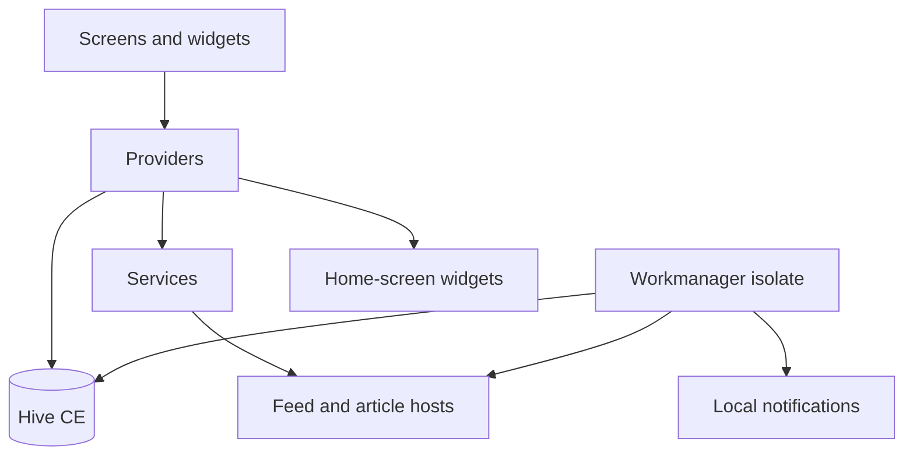

# Dondurma Geliştirici Rehberi

Kaynak kodu özeti: 2026-08-24. Çelişkide kaynak kodu esas alınır.

## Çalışma zamanı

`main()` sırası:

1. Flutter binding ve `WidgetUpdateService` başlatılır.
2. Hive CE `settings`, `feeds`, `bookmarks` kutuları açılır.
3. Eski tek-kutu şeması `_migrateHiveBoxes()` ile bir kez taşınır.
4. `NotificationService` ve Workmanager hazırlanır.
5. Bildirim/home-widget deep link akışları GoRouter'a bağlanır.
6. Ağır izin/ad-block listesi işleri beklenmeden başlatılır.
7. Provider ağacı ve `MyApp` çalıştırılır.

## Mimari


```mermaid
flowchart TD
  UI[Screens and widgets] --> P[Providers]
  P --> H[(Hive CE)]
  P --> S[Services]
  S --> N[Feed and article hosts]
  W[Workmanager isolate] --> H
  W --> N
  W --> L[Local notifications]
  P --> HW[Home-screen widgets]
```

Provider'lar:

- `SettingsProvider`: tema, dil, cache/sync, bildirim, okuma, filtre, WebView tercihleri.
- `SubscriptionProvider`: abonelik, özel kategori, kategori simgesi/sırası.
- `BookmarkProvider`: tam makale JSON'u ve hızlı ID kümesi.
- `FeedProvider`: fetch, filtre, arama, sayfalama, cache, okundu, bildirim, widget güncelleme.
- `ArticlePageProvider`: sayfa bazlı scroll, tam metin, okuma ilerlemesi.

`FeedProvider`, `ChangeNotifierProxyProvider3` ile Subscription/Settings/Bookmark alır. `filterInputsChanged` yalnız filtreyi etkileyen keyword ve bookmark girdileri değişince filtre cache'ini bozar.

## Kalıcılık

### `settings`

`flexScheme`, `themeMode`, `locale`, `offlineCacheLimit`, `cacheIntervalSeconds`, `syncBackground`, `notificationsEnabled`, `digestMode`, `quietHoursEnabled`, `quietHoursStart`, `quietHoursEnd`, `fontSize`, `typeface`, `lineSpacing`, `globalExcludedKeywords`, `searchHistory`, `adBlockEnabled`, `webviewDarkModeEnabled`, `browserMode`, `autoFullText`, `hasSeenOnboarding`, `_boxesMigrated`.

Varsayılanlar: 50 cache öğesi, 1800 saniye yenileme (kayıt yok/0), arka plan açık, anlık bildirim, 22–07 sessiz saat, yerleşik tarayıcı, global tam metin kapalı.

### `feeds`

- `subscriptions`: JSON `FeedSubscription` listesi
- `custom_categories`, `category_icons`, `category_order`
- `cachedItemsJson`, `readItemIds`
- `feedValidators`: URL bazlı ETag/Last-Modified
- `bgKnownItemIds`: yalnız eski sürüm migration kanıtı; aktif deduplication kaynağı değildir

### `bookmarks`

`bookmarkedItemsJson` tam öğeleri; `bookmarkedItemIds` hızlı üyelik kontrolünü tutar.

Yeni kalıcı alanlarda eski kayıtlar için fallback zorunlu. `FeedSubscription.fullTextEnabled` tri-state: `null` global ayarı izler, `true` zorla açar, `false` zorla kapatır. `fullTextSchema: 2` eski `false` kayıtlarını ayırır.

## Feed hattı

`FeedService` ortak keep-alive `http.Client`, browser User-Agent, zaman aşımı, ETag/Last-Modified ve 304 desteği kullanır. RSS/Atom gövdesi `compute(parseFeedBody, ...)` içinde ayrıştırılır. Eksik ID için kararlı fallback üretilir; feed başına öğe sayısı sınırlandırılır.

`FeedProvider.refreshAll()`:

- eşzamanlı çağrıları `_refreshQueued` ile birleştirir;
- en fazla beş fetch çalıştırır;
- yeni/304/hatalı sonuçları mevcut cache ile birleştirir;
- global ve feed keyword filtrelerini uygular;
- ilk yüklemede bildirim göndermez (`_hasLoadedOnce`);
- cache ve home widget verisini günceller.

Sayfalama 50 öğe ile başlar; kategori, arama veya filtre değişiminde sıfırlanır. Bölümler Today/Yesterday/Older mantığıyla tarih bazlıdır.

## Tam metin

`FullTextExtractionService` orijinal sayfayı browser başlıklarıyla çeker. Heuristic extractor script/style/nav gibi gürültüyü temizleyip en güçlü içerik adayını seçer. Ayrıştırma isolate içinde; paylaşılan FIFO cache 20 öğedir. Manuel makale seçimi, feed tri-state ve `autoFullText` birlikte değerlendirilir.

## Senkronizasyon ve bildirim

Ön plan timer'ı `cacheIntervalSeconds` ile yönetilir; provider güncellemesinde `_manageCacheTimer()` yeniden değerlendirir. Resume politikası `shouldRefreshOnResume` ile son yenileme ve eşik üzerinden karar verir.

Workmanager unique işi `rss_bg_fetch`, bağlı ağ koşulu ve platformun 15 dakikalık minimum periyodu ile kaydolur. Background isolate kutuları kendi açar, feed'leri çeker ve cache'i limitleyip yazar. Yeni öğeler, `ObservedArticleStore` içindeki feed + subscription epoch namespace'li 14 günlük geçmişten atomik claim edilir. Foreground ve Workmanager aynı state dosyasını, `File.create(exclusive: true)` lock ownership ve fail-closed timeout ile paylaşır.

Observation delivery'den önce gelir. Global/per-feed kapalı, quiet hours veya non-instant digest durumunda ID observed kalır; sonra backfill edilmez. Yalnız başarılı feed sonucu history'yi günceller; failure başka feed'in geçmişini silemez. İlk başarılı fetch ve her yeni subscription epoch sessiz initialize edilir.

`NotificationService` desteklenen platformlarda çalışır. Ana şalter, feed şalteri, ilk-yükleme koruması, sessiz saat ve `digestMode == instant` şartları uygulanır. Daily/weekly seçimi anlık bildirimi bastırır; zamanlanmış digest üretmez.

## Sistem entegrasyonları

- `WidgetUpdateService`: `widget_latest`, kategori grupları, Android widget sınıfları, iOS App Group `group.io.devopen.dondurma`.
- Deep link: `homewidget://article?id=<id>`; öğe yerel cache/bookmark içinde aranır.
- `InAppBrowser`: yerleşik WebView veya external/system açılış; EasyList/AdGuard; isteğe bağlı DarkReader.
- `OpmlService`: nested/flat OPML, duplicate URL atlama, sistem dosya seçici/paylaşım sayfası.
- `ImageCacheService`: makale ve küçük görsel için ayrı cache manager'lar.

## Routing ve UI

- `/onboarding`: `hasSeenOnboarding` öncesi hedef; oturum bypass desteği.
- `/`: Feeds, Folders, Bookmarks, Settings sekmeleri.
- `/article`: `{items, initialIndex}` extra ile PageView.
- `/debug`: sürüm numarasına uzun basarak ulaşılan araçlar.

`MyApp`, tema/dil alanlarında `context.select` kullanır. `AppToastHost`, GoRouter child'ını sarar; yeni toast eskisini kuyruksuz değiştirir, modal varken konumunu ayarlar, azaltılmış hareketi izler.

## Yerelleştirme

Kaynaklar `app_en.arb`, `app_tr.arb`, `app_es.arb`. Dil listesi `supportedAppLanguages` üzerinden türetilir. `app_localizations*.dart` üretilir; elle düzenlenmez. ARB değişiminden sonra:

```bash
flutter gen-l10n
```

## Test ve doğrulama

Mevcut testler feed parse/isolate, fetch yardımcıları, filtre girdileri/runtime filtre, resume kararı, feed satırı, toast ve geniş ekran regresyonlarını kapsar.

```bash
flutter analyze
flutter test
```

Platform entegrasyonu değişirse ilgili Android/iOS build veya cihaz smoke testi eklenir.

## Kritik kurallar

- JSON/Hive deserialization fallback'siz bırakılmaz.
- Yeni `feeds`/`bookmarks` anahtarında legacy migration ihtiyacı kontrol edilir.
- `refreshAll()` concurrency ve ilk-yükleme bildirim korumaları bozulmaz.
- `NotificationService.requestPermission()` ve ad-block initialize çağrıları kasıtlı olarak `runApp` sonrası beklenmez.
- `assets/Logo.png` launcher kaynağıdır; runtime asset değildir. Runtime listesi `assets/logo.ico`, `assets/js/`.
- Toast için `lib/utils/app_toast.dart` kullanılır; eski snackbar helper yoktur.
